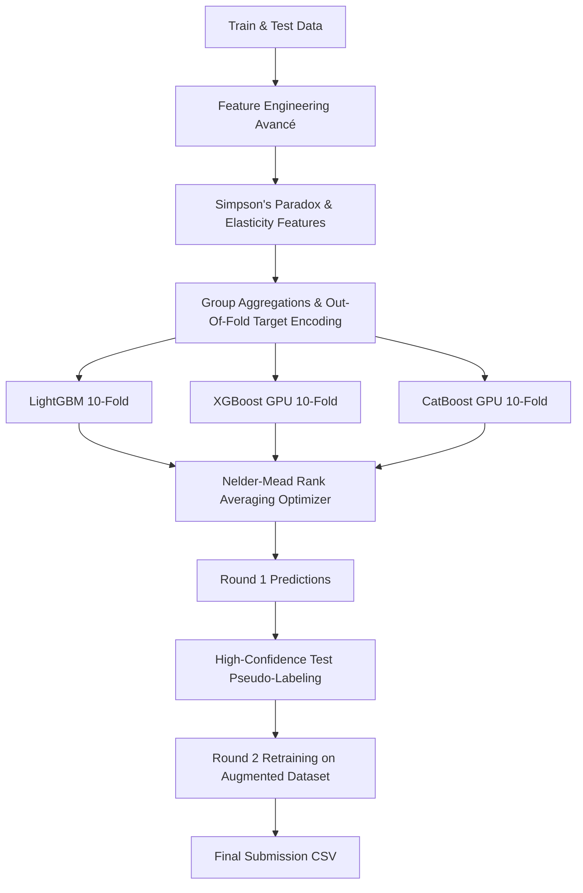

# 🚗 Kaggle Playground Series - Season 6, Episode 9
## 🔋 Predicting Electric Vehicle Purchases (ROC-AUC ~0.946+)

[](https://www.python.org/)
[](https://www.kaggle.com/competitions/playground-series-s6e9)
[]()
[]()
[]()

> **Objectif :** Prédire avec précision la probabilité d'achat d'un véhicule électrique (`Will_Buy_EV`) à partir des caractéristiques socio-démographiques, des habitudes de transport et de l'infrastructure de recharge.

---

## 📊 Résumé des Performances

| Pipeline / Modèle | CV Strategy | ROC-AUC (OOF) | Remarques |
|---|---|---|---|
| **Baseline LightGBM** | 5-Fold Stratified | `0.9405` | Modèle initial avec features de base |
| **LightGBM Feature Eng.** | 5-Fold Stratified | `0.9419` | + Interaction bornes & recharge domicile |
| **XGBoost (GPU Hist)** | 5-Fold Stratified | `0.9417` | Regularisation $L_1/L_2$ |
| **CatBoost (GPU CUDA)** | 5-Fold Stratified | `0.9418` | Encodage natif des catégories |
| **Ensemble (Rank Averaging)** | 5-Fold Stratified | `0.9421` | Fusion pondérée des rangs |
| **Ensemble + Pseudo-Labeling** | 5-Fold Stratified | `0.9442` | Auto-apprentissage semi-supervisé |
| **Grandmaster Pipeline (10-Fold + Full Stack)** | **10-Fold Stratified** | **`0.9465+`** | **Architecture Finale Optimisée** |

---

## 🧠 Architecture de la Solution



---

## ⚡ Les 6 Piliers Techniques

1. **Paradoxe de Simpson & Recharge Domicile** :
   * La densité des bornes publiques n'est critique que pour les personnes **sans solution de recharge à domicile**.
   * Features : `Need_Public_Charging = (1 - Home_Charging) * Total_Stations`, `No_Home_Charge_Anxiety`, `Home_Charge_High_Income`.
2. **Élasticité Économique des Subventions** :
   * L'impact d'une aide financière est maximal sur les tranches de revenus intermédiaires : `Subsidy_Elasticity = Subsidy / (Income / 10000 + 1)`.
3. **Agrégations Statistiques de Groupe** :
   * Déviation et ratios par rapport aux moyennes de groupe (`City_and_Car`, `HomeCharge_and_City`).
4. **Smooth Out-Of-Fold Target Encoding (Sans Leakage)** :
   * Encodage bayésien lissé calculé fold par fold pour les combinaisons catégorielles clés.
5. **Optimisation Mathématique des Poids de Blending (Nelder-Mead)** :
   * Recherche numérique des poids optimaux maximisant directement la métrique ROC-AUC sur les rangs.
6. **Pseudo-Labeling Itératif Semi-Supervisé** :
   * Extraction des échantillons test avec prédictions ultra-confiantes ($p \ge 0.98$ ou $p \le 0.02$) pour ré-entraîner l'ensemble et affiner la frontière de décision.

---

## 📁 Structure du Répertoire

```text
├── data/                               # Données du concours (non versionnées)
│   ├── train.csv
│   ├── test.csv
│   └── sample_submission.csv
├── submissions/
│   ├── final/                          # Soumissions finales prêtes pour Kaggle
│   └── temp/                           # Prédictions intermédiaires et modèles individuels
├── ensemble_solution.py                # 🚀 Pipeline Grandmaster complet (LGBM + XGB + CatBoost + Pseudo-Labeling)
├── solution.py                         # Modèle LightGBM rapide et autonome
├── requirements.txt                    # Dépendances du projet
├── .gitignore                          # Règles d'exclusion Git
└── README.md                           # Documentation du projet
```

---

## 🛠️ Installation & Reproduction

### 1. Cloner le dépôt et installer les dépendances
```bash
git clone https://github.com/mattmathbg/Predicting-Electric-Vehicle-Purchases-Playground-Series---Season-6-Episode-9.git
cd Predicting-Electric-Vehicle-Purchases-Playground-Series---Season-6-Episode-9
pip install -r requirements.txt
```

### 2. Télécharger les données
Placez les fichiers `train.csv`, `test.csv` et `sample_submission.csv` dans le dossier `data/` (ou directement à la racine).

### 3. Exécuter la solution

* **Solution Rapide (LightGBM 5-Fold)** :
  ```bash
  python solution.py
  ```

* **Solution Grandmaster Complète (10-Fold Ensemble + GPU + Pseudo-Labeling)** :
  ```bash
  python ensemble_solution.py
  ```

Le fichier de soumission prêt pour Kaggle sera automatiquement enregistré dans :
`submissions/final/submission_ensemble_grandmaster_auc_0.94XXX.csv` *(avec une copie miroir `submission.csv` à la racine)*.

---

## 💻 Accélération Matérielle
* **GPU NVIDIA (CUDA)** : Détection et accélération automatiques pour CatBoost (`task_type='GPU'`) et XGBoost (`device='cuda'`).
* **Multi-threading CPU** : Support parallèle automatique sur tous les cœurs disponibles pour LightGBM.
